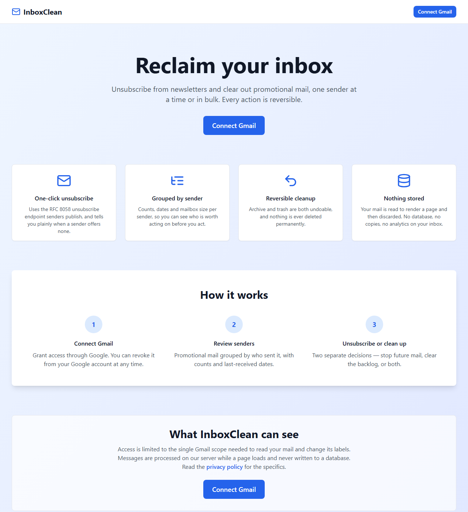

# InboxClean

**Bulk-unsubscribe from newsletters and clear promotional mail out of Gmail — with every action reversible.**

[](https://github.com/Jes-ika/Inbox_cleaner/actions/workflows/ci.yml)




Gmail's Promotions tab accumulates hundreds of newsletters you no longer read.
Unsubscribing from each one by hand is slow, and mass-deleting them is
irreversible. InboxClean groups the backlog by sender, so you can see who is
worth acting on, then treats *stopping future mail* and *clearing the existing
backlog* as two separate decisions — because they are.

---

## Contents

- [What it does](#what-it-does)
- [Engineering highlights](#engineering-highlights)
- [Quick start](#quick-start)
- [Commands](#commands)
- [How it works](#how-it-works)
- [Project structure](#project-structure)
- [Tests](#tests)
- [Going to production](#going-to-production)

## What it does

| Screen | Purpose |
| --- | --- |
| **Dashboard** | How much promotional mail you have, how many senders, how much space it takes |
| **Subscriptions** | Every promotional sender, with a one-click unsubscribe where they publish one |
| **Cleanup** | Select senders, then archive or trash their mail in bulk — with Undo |
| **Settings** | Connected account, granted scope, local activity log, disconnect |

Two ideas shape the whole design:

1. **Unsubscribing and cleaning up are separate.** Stopping future mail says
   nothing about whether you want the last two years of it gone, so the app
   never conflates them.
2. **Nothing is destroyed.** Archive only removes the inbox label; trash is
   Gmail's 30-day bin. Both are reversible from the confirmation toast, and the
   app never issues a permanent delete.

## Engineering highlights

The parts worth reading if you are evaluating the code:

**SSRF-hardened outbound requests** — [`lib/safe-fetch.ts`](lib/safe-fetch.ts)

`List-Unsubscribe` URLs are written by whoever sent you the mail, so fetching
one lets a stranger choose a destination for a request leaving your server. The
unsubscribe endpoint therefore accepts a *sender address*, never a URL, and
resolves the target from that sender's own headers. Every URL is checked for
scheme, embedded credentials and resolved address — and every redirect hop is
re-checked.

The address check decodes IPv6 to its 16 bytes rather than pattern-matching the
text, because the WHATWG URL parser re-serialises `[::ffff:127.0.0.1]` to
`::ffff:7f00:1`. A dotted-quad regex misses that entirely while the host still
reaches loopback. IPv4-mapped, IPv4-compatible, NAT64 and 6to4 wrappers are all
resolved to the address they actually carry.

**RFC 8058 one-click unsubscribe** — [`lib/gmail.ts`](lib/gmail.ts)

When a sender advertises `List-Unsubscribe-Post: List-Unsubscribe=One-Click`,
the request must be a POST with that exact body; a GET is what image
pre-fetchers send, and senders routinely ignore it. A `301`/`302`/`303` on the
way downgrades the POST to a GET, so the result is reported as *needs your
action* rather than claimed as success.

**OAuth token lifecycle** — [`lib/auth.ts`](lib/auth.ts), [`lib/api-auth.ts`](lib/api-auth.ts)

Access and refresh tokens live in an encrypted HTTP-only cookie and are never
copied onto the session object, so `/api/auth/session` cannot hand them to page
scripts. The JWT callback refreshes ahead of expiry; route handlers check expiry
themselves too, because `getToken()` only decrypts the cookie — it never runs
the callback — so a tab left open past the hour would otherwise hand Gmail a
dead token.

**Quota-aware Gmail access** — [`lib/concurrency.ts`](lib/concurrency.ts)

Gmail allows roughly 250 quota units per second per user and `messages.get`
costs 5, so scans run through a concurrency pool with exponential backoff and
full jitter. The retry predicate distinguishes a 403 that means *rate limited*
from a 403 that means *forbidden*, reading the shapes `gaxios` actually throws.

**Truthful reporting** — [`lib/summary.ts`](lib/summary.ts)

Counts shown to the user are the counts that will change. Archiving already
archived mail does nothing, so Cleanup acts only on the inbox subset while
Subscriptions still lists every sender; a partial trash reports what actually
moved, and Undo targets exactly that. When a scan cannot cover the whole
mailbox, the UI says so instead of presenting a partial figure as the total.

## Quick start

You need Node 18+ and your own Google OAuth credentials — the app talks to your
real mailbox, so there is no shared demo key.

```bash
git clone https://github.com/Jes-ika/Inbox_cleaner.git
cd Inbox_cleaner
npm install
cp .env.example .env.local   # then fill it in, see below
npm run dev
```

### Google credentials

1. In the [Google Cloud Console](https://console.cloud.google.com/), create a project.
2. Enable the **Gmail API**.
3. Configure the OAuth consent screen: add the scope
   `https://www.googleapis.com/auth/gmail.modify`, and add your own Google
   account under **Test users**. A restricted scope only works for listed test
   users until the app is verified.
4. **Credentials → OAuth client ID → Web application.**
5. Authorized redirect URI, exactly:
   `http://localhost:3000/api/auth/callback/google`

Then fill in `.env.local`:

```env
GOOGLE_CLIENT_ID=…apps.googleusercontent.com
GOOGLE_CLIENT_SECRET=GOCSPX-…
NEXTAUTH_SECRET=…
NEXTAUTH_URL=http://localhost:3000
```

Generate the session secret with:

```bash
node -e "console.log(require('crypto').randomBytes(32).toString('base64'))"
```

Note the name: **`GOOGLE_CLIENT_ID`**, not `NEXT_PUBLIC_GOOGLE_CLIENT_ID`. It is
only ever read on the server and has no business in the browser bundle.

Open <http://localhost:3000> and choose **Connect Gmail**.

## Commands

| Command | What it does |
| --- | --- |
| `npm run dev` | Development server on :3000 |
| `npm run build` | Production build |
| `npm start` | Serve the production build |
| `npm run lint` | ESLint (flat config, runs non-interactively) |
| `npm run typecheck` | `tsc --noEmit` |
| `npm test` | Vitest, once |
| `npm run test:watch` | Vitest, watching |
| `npm run verify` | typecheck + lint + test |
| `npm run clean` | Remove `.next` (fixes stale-build errors after an install) |

## Tech stack

| Concern | Choice |
| --- | --- |
| Framework | Next.js 15 (App Router), React 18, TypeScript (strict) |
| Styling | Tailwind CSS, `class-variance-authority` for component variants |
| Components | Radix UI primitives (dialog, dropdown menu), `lucide-react` icons |
| Auth | NextAuth v4, Google provider, JWT sessions |
| Mail | Gmail API via `googleapis` |
| Tests | Vitest |
| Persistence | None server-side. Session in an encrypted cookie; an activity log in `localStorage` |

## How it works

### Scanning

`GET /api/emails/promotional` walks the Gmail Promotions category
(`category:promotions`), requesting only the `From`, `List-Unsubscribe` and
`List-Unsubscribe-Post` headers, then groups messages by sender.

**Discovery and action have different scopes, on purpose.** The scan records
whether each message still carries the `INBOX` label, and each sender therefore
carries both `messageIds` (everything) and `inboxMessageIds` (the subset Cleanup
may act on).

That split exists because neither scope works alone:

- Archiving mail that is already archived changes nothing. Counting it would
  overstate the result, and undoing that "archive" would add `INBOX` to hundreds
  of messages that were never in the inbox — dumping old mail back into it. So
  **Cleanup uses the inbox subset**, which keeps its counts truthful and makes
  undo a real inverse.
- But scoping *discovery* to the inbox hides any sender whose mail is already
  archived. A user with a skip-inbox filter would see no senders at all while
  still subscribed to every one of them, and using Cleanup would empty the
  Subscriptions list of exactly the senders they had just rejected. So
  **Subscriptions uses the full list**.

Two limits keep a scan inside Gmail's per-user quota (roughly 250 units/second,
and `messages.get` costs 5): requests run through a concurrency cap with
exponential backoff on 429 and 5xx, and the scan stops at
`DEFAULT_SCAN_LIMIT` (500) messages. `?limit=` overrides it up to
`MAX_SCAN_LIMIT` (2000).

When there is more mail than the window, `truncated` is set and every screen
renders the `ScanCoverage` notice rather than presenting a partial count as the
total. Because the window is shared with archived mail, the response also
carries `totalEstimate` and `inboxEstimate` — Gmail's own `resultSizeEstimate`
from two one-unit list calls — so the notice can say how much lies beyond it
instead of only that something does.

### Unsubscribing

`POST /api/emails/unsubscribe` takes a **sender address**, never a URL. The
server finds that sender's recent mail in the user's own mailbox and reads the
unsubscribe endpoint out of its headers.

This matters: `List-Unsubscribe` values are written by whoever sent the mail. An
endpoint that fetched a URL from the request body would let any caller point the
server at `169.254.169.254` or anything else it can reach. Every URL is checked
for scheme, credentials and resolved address before a request goes out, and each
redirect hop is re-checked — see [`lib/safe-fetch.ts`](lib/safe-fetch.ts).

When the sender advertises RFC 8058 one-click (`List-Unsubscribe-Post:
List-Unsubscribe=One-Click`) the request is a POST with that body. A `mailto:`-only
sender is reported as needing the user's action, because sending mail on the
user's behalf would need a scope this app does not request.

### Cleanup and undo

Archive uses `messages.batchModify` to drop the `INBOX` label. Trash uses
`messages.trash`, pooled under the same concurrency cap. Both are reversed by
`POST /api/emails/undo`, offered as an Undo action on the confirmation toast.

Trash is applied per message, so a single stale id cannot fail the batch: the
route reports `{trashedCount, failed, messageIds}` where `messageIds` is only
what actually moved, and Undo targets exactly that list. It returns 502 only
when nothing moved at all.

Nothing is ever permanently deleted. Gmail keeps trashed mail for 30 days.

### Tokens

The Google access and refresh tokens live in the NextAuth JWT, inside an
encrypted HTTP-only cookie. They are **not** copied onto the session object, so
`/api/auth/session` does not hand them to page scripts. Route handlers read them
with `getToken()`.

The JWT callback refreshes the access token about a minute before it expires. If
the refresh token itself stops working, the session is stamped with
`RefreshAccessTokenError` and the client asks for consent again — once per tab,
then it surfaces a Reconnect button rather than looping.

## API

| Endpoint | Body | Notes |
| --- | --- | --- |
| `GET /api/emails/promotional` | — | `?limit=` up to 2000, defaults to 500 |
| `POST /api/emails/archive` | `{messageIds}` | Removes the `INBOX` label |
| `POST /api/emails/trash` | `{messageIds}` | Recoverable for 30 days |
| `POST /api/emails/undo` | `{kind, messageIds}` | `kind` is `trash` or `archive` |
| `POST /api/emails/unsubscribe` | `{sender}` | A sender **address**, never a URL |

Every route requires a session. `messageIds` is capped at 1000 per request and
each id is validated.

## Project structure

```
app/
  api/
    auth/[...nextauth]/route.ts   NextAuth handler
    emails/promotional/route.ts   Scan and group
    emails/archive/route.ts       Remove the INBOX label
    emails/trash/route.ts         Move to trash
    emails/undo/route.ts          Reverse either of the above
    emails/unsubscribe/route.ts   Look up and call a sender's endpoint
  page.tsx                        Landing page
  dashboard/  subscriptions/  cleanup/  settings/
  privacy/  terms/                Required for OAuth verification
  error.tsx  loading.tsx  not-found.tsx
components/
  layout/    AppShell, Header, Sidebar, MobileNav, LegalPage
  senders/   SenderToolbar, ScanCoverage
  ui/        Button, Card, Modal, Spinner, Toast
  marketing/ ConnectButton
hooks/
  useAuth, usePromotionalEmails, useSenderView
lib/
  auth.ts          NextAuth config and token refresh
  gmail.ts         Gmail calls and header parsing
  safe-fetch.ts    Outbound request guard
  concurrency.ts   Pooling, chunking, retry
  api-auth.ts      Token lookup and input validation for routes
  api-client.ts    Browser-side fetch wrapper
  summary.ts       Applies a completed cleanup to a scan summary
  format.ts        Relative time, byte sizes
  history.ts       localStorage activity log
middleware.ts      Edge protection for the app routes
```

Tests sit next to what they cover: `lib/*.test.ts`.

## Tests

112 tests over the layer where the bugs actually live — header parsing, sender
grouping, the SSRF guard, the retry predicate, the auth gate, and the
cleanup/undo bookkeeping:

```bash
npm test
```

Several encode specific bugs that were found and fixed, so they stay fixed:

- A sender's "last received" date must be the newest message, not whichever was
  processed last.
- An unsubscribe link must be picked up from any of a sender's messages.
- A 403 is only retried when its reason is a rate limit, and the retry predicate
  must read the shapes gaxios really throws (`status`, `response.data.error.errors`)
  rather than a hand-made `{code: 429}`.
- A sender whose mail is entirely archived still appears, so they stay
  unsubscribable, but contributes nothing to `inboxMessageIds`.
- `requireAccessToken` refreshes an expired token inline and returns
  `reauth_required` — not a 502 — when the refresh token itself is dead.
- Archiving shrinks only a sender's inbox subset and never removes the sender,
  while trashing removes the mail outright.
- `assertSafeUrl('https://[::ffff:127.0.0.1]/')` must be blocked. This one is
  asserted through the URL boundary on purpose: the WHATWG parser rewrites that
  host to `::ffff:7f00:1`, so a unit test on the dotted-quad spelling passes
  while the guard is fully bypassable.

## Going to production

1. Set `NEXTAUTH_URL` to your deployed `https://` origin.
2. Add `https://your-domain/api/auth/callback/google` to the OAuth client's
   authorized redirect URIs.
3. Generate a fresh `NEXTAUTH_SECRET` — do not reuse the development one.
4. Put your own contact details and legal entity into `app/privacy/page.tsx`;
   the placeholder paragraph says where.

Then the part that takes calendar time: `gmail.modify` is a **restricted scope**.
Until the app passes Google's OAuth verification *and* an annual CASA security
assessment, it is capped at 100 test users and shows an unverified-app warning.
Verification needs a hosted privacy policy, a homepage on a verified domain, a
demo video of the consent flow, and a written scope justification. Start it
early; it is the long pole, not the code.

### Known dependency advisories

`npm audit` reports two remaining issues (one moderate in `next`, one high in the
`postcss` that Next bundles). Both are only resolved by Next 16, a major upgrade
that also requires React 19. The `postcss` advisories concern attacker-controlled
CSS, and this app serves no third-party CSS. Revisit when taking the Next 16
upgrade deliberately.

## Further reading

- [`QUICK_START.md`](QUICK_START.md) — the five-minute setup and a troubleshooting table
- [`docs/history/`](docs/history) — build notes from the project's earlier phases, kept for context

## License

[MIT](LICENSE)
